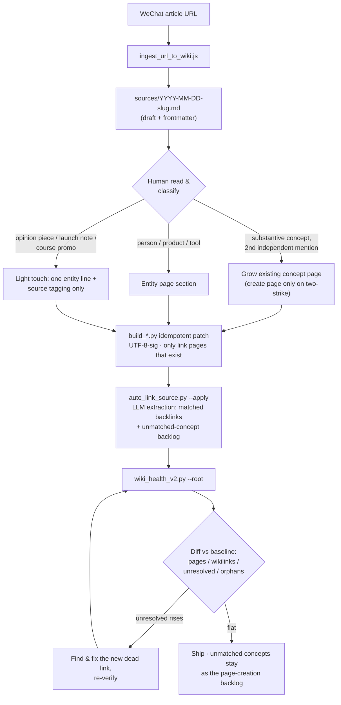

# LLM Wiki Evolution

English | [中文](./README.zh-CN.md)

> 🆕 **2026-09-09** — New practice output: *The Seven-Layer Tower* (《七层塔》), a fact-grounded
> nonfiction novel about how the AI agent harness stack evolved — L1 Prompt → L2 Tools →
> L3 Memory → L4 Skills → L5 Subagents → L6 Evaluation → L7 Self-Improvement — written entirely
> on top of a production wiki maintained with this skill.
> Read it as [full article (HTML)](assets/seven-layer-tower/七层塔-全文.html) ·
> [PDF](assets/seven-layer-tower/七层塔-全文.pdf) ·
> [interactive edition](assets/seven-layer-tower/七层塔-可交互.html).

A skill that evolves and governs a Karpathy-style LLM wiki into a reliable
decision-grade knowledge system. Use it to audit an existing wiki, fix
structural issues, ingest sources with automatic backlinking, and enforce
measurable quality gates.

## What it does

- **Audits wiki health** (unresolved wikilinks, orphan pages, duplicate
  concepts, stale evidence) with an Obsidian-style resolution model.
- **Governs naming** with a canonical-name policy and alias-to-canonical
  mapping.
- **Auto-links sources**: scans an ingested source page for concepts that
  already exist in the wiki and appends a "Related sources" backlink
  section — idempotently, and dry-run by default.
- **Creates alias stubs** for missing concepts, either one-off or in bulk
  from a health report.
- **Adds evidence and decision layers** so high-impact claims carry
  source links, verification dates, and ADR-style decision records.
- **Enforces quality gates** that fail maintenance runs when unresolved
  links rise or evidence coverage drops below threshold.

## Layout

```
SKILL.md                              # main skill entrypoint
agents/openai.yaml                    # Codex/agent interface metadata
references/
  canonical-naming.md                 # naming policy and mapping format
  governance-checklist.md             # quality gates, evidence & ADR rules
scripts/
  ingest_url_to_wiki.js               # single entrypoint URL -> wiki page
  wiki_health_check.py                # v1 health audit + canonical CSV starter
  wiki_health_v2.py                   # v2 health scanner (Obsidian-style resolution)
  auto_link_source.py                 # append "Related sources" backlinks to a source page
  make_alias_stub.py                  # generate alias stub pages (single or bulk)
```

## Quick start

```powershell
# Audit a wiki (v2: Obsidian-style link resolution, excludes backups/snapshots)
python scripts/wiki_health_v2.py --root <wiki_root>

# v1 audit + generate a canonical-map.csv starter from unresolved links
python scripts/wiki_health_check.py --root <wiki_root> --emit-canonical-template

# Ingest a URL into the wiki
node scripts/ingest_url_to_wiki.js --url "<url>" --wiki-root "<wiki_root>" --tags "#ingest #source"

# Auto-link an ingested source page (dry-run first, then --apply)
python scripts/auto_link_source.py --wiki <wiki_root> --source sources/<page>.md
python scripts/auto_link_source.py --wiki <wiki_root> --source sources/<page>.md --apply

# Create one alias stub pointing at its best source
python scripts/make_alias_stub.py --root <wiki_root> --name "My_Concept" \
  --target sources/2026-01-01-some-source.md

# Bulk-create stubs for broken references seen >= 2 times in a health report
python scripts/make_alias_stub.py --root <wiki_root> \
  --from-health wiki-health-v2.json --min-freq 2
```

## The daily ingest pipeline

Every ingested article goes through this exact loop on the production wiki —
classify, patch idempotently, auto-link, then verify against a running
baseline. GitHub renders the diagram natively:



1. **Ingest** — `ingest_url_to_wiki.js` lands a draft source page with
   frontmatter (`source_url`, `captured_at`, tags).
2. **Classify (human pass)** — substantive concepts grow existing pages; a
   brand-new concept page is created only after two independent sources
   mention it substantively (the two-strike rule). People, products and
   tools belong on entity pages. Opinion pieces, launch notes and course
   promos get a light touch only: one entity line plus source tagging.
3. **Patch** — a one-off `build_*.py` applies the enrichment; it skips when
   its section marker already exists (idempotent), writes UTF-8-sig, and may
   only link pages that already exist.
4. **Auto-link** — `auto_link_source.py` extracts concepts with an LLM,
   appends the "Related sources" section, adds backlinks to matched pages,
   and records unmatched concepts on the source page — that block doubles as
   the page-creation backlog queue.
5. **Verify** — `wiki_health_v2.py` diffs the four metrics against the
   running baseline. `unresolved` must stay flat: any rise means a new dead
   link was introduced, and the run does not ship until it is fixed.

## Hard-won practices from production

These rules were baked into the scripts after running this workflow daily on
a 1300+ page production wiki.

**Idempotent linking.** `auto_link_source.py` skips source pages that already
carry an auto-linked "Related sources" section, so re-running after manual
edits never duplicates or clobbers annotations. It defaults to dry-run;
`--apply` is the explicit mutation gate.

**Snapshot hygiene in health stats.** `wiki_health_v2.py` excludes `.bak`
files, backup directories, and log snapshots from live-link counting.
Without this, stale copies "launder" orphan and dead-link numbers and mask
real regressions.

**Three-part link normalization.** The link resolver treats page keys as
equal after (1) stripping the `.md` suffix, (2) stripping hyphens, and
(3) lowercasing and removing spaces/underscores. Wikis mixing
`[[Agent_Memory]]` with `sources/agent-memory` links produce exploding
false positives without all three normalizations.

**Second-mention page creation ("two-strike rule").** A concept earns its
own page only after two independent sources reference it substantively. A
single mention, or a weak/passing reference, goes into an existing page or
stays as an unmatched-concept note in the source page — that note block is
the backlog queue for future page creation.

**Zero-dead-link gate.** New pages may only link to pages that already
exist. Combined with the health scanner as a post-ingest check, this keeps
`unresolved` flat while the wiki grows. A rising unresolved count fails the
maintenance run.

**Smoke-test before publishing tool changes.** After modifying any script,
run it against the real wiki and diff the health numbers against the known
baseline before shipping. The scanner's `--root` parameter exists precisely
so the packaged copy can be validated against a live wiki without
hard-coded paths.

## License

MIT (see `LICENSE`).
