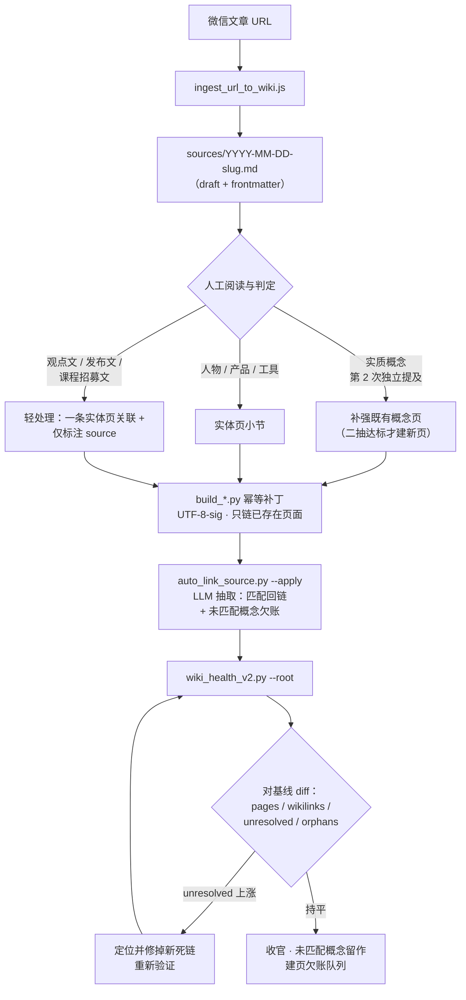

# LLM Wiki Evolution

[English](./README.md) | 中文

> 🆕 **2026-09-09** — 新实践产出：《七层塔》，一部以事实为底座的非虚构小说，讲述 AI Agent
> Harness 技术栈的逐层进化 —— L1 Prompt → L2 Tools → L3 Memory → L4 Skills → L5 Subagents →
> L6 Evaluation → L7 Self-Improvement。全书完全基于一个用本 skill 维护的生产级 wiki 写成。
> 阅读入口：[全文（HTML）](assets/seven-layer-tower/七层塔-全文.html) ·
> [PDF](assets/seven-layer-tower/七层塔-全文.pdf) ·
> [交互版](assets/seven-layer-tower/七层塔-可交互.html)。

一个把 Karpathy 风格 LLM wiki 演化并治理为可靠、决策级知识系统的 skill。用它审计既有
wiki、修复结构性问题、摄入带自动反链的来源，并执行可量化的质量门。

## 它做什么

- **审计 wiki 健康度**（死链、孤页、重复概念、过时证据），采用 Obsidian 风格的链接解析模型。
- **治理命名**：规范名策略 + 别名到规范名的映射。
- **自动补链来源页**：扫描摄入的 source 页，找出 wiki 中已存在的概念并追加
  "相关来源" 反链小节 —— 幂等，默认 dry-run。
- **创建别名占位页**：为缺失概念生成 stub，支持单次创建或从健康报告批量创建。
- **补充证据层与决策层**：让高影响论断带上来源链接、验证日期和 ADR 风格的决策记录。
- **执行质量门**：当死链上升或证据覆盖率跌破阈值时，让维护运行直接失败。

## 目录结构

```
SKILL.md                              # skill 主入口
agents/openai.yaml                    # Codex/agent 接口元数据
references/
  canonical-naming.md                 # 命名策略与映射格式
  governance-checklist.md             # 质量门、证据与 ADR 规则
scripts/
  ingest_url_to_wiki.js               # 单一入口：URL -> wiki 页面
  wiki_health_check.py                # v1 健康审计 + canonical CSV 起步文件
  wiki_health_v2.py                   # v2 健康扫描器（Obsidian 风格解析）
  auto_link_source.py                 # 为 source 页追加"相关来源"反链
  make_alias_stub.py                  # 生成别名占位页（单个或批量）
```

## 快速开始

```powershell
# 审计 wiki（v2：Obsidian 风格链接解析，排除备份/快照）
python scripts/wiki_health_v2.py --root <wiki_root>

# v1 审计 + 从死链生成 canonical-map.csv 起步文件
python scripts/wiki_health_check.py --root <wiki_root> --emit-canonical-template

# 把一个 URL 摄入 wiki
node scripts/ingest_url_to_wiki.js --url "<url>" --wiki-root "<wiki_root>" --tags "#ingest #source"

# 为摄入的 source 页补链（先 dry-run，确认后 --apply）
python scripts/auto_link_source.py --wiki <wiki_root> --source sources/<page>.md
python scripts/auto_link_source.py --wiki <wiki_root> --source sources/<page>.md --apply

# 创建一个别名占位页，指向其最佳来源
python scripts/make_alias_stub.py --root <wiki_root> --name "My_Concept" \
  --target sources/2026-01-01-some-source.md

# 按健康报告中出现 >= 2 次的死链引用批量建 stub
python scripts/make_alias_stub.py --root <wiki_root> \
  --from-health wiki-health-v2.json --min-freq 2
```

## 每日入库流水线

每一篇入库文章在生产 wiki 上走的都是这条固定链路——判定、幂等补强、自动
补链、对基线验证。GitHub 原生渲染下面的流程图：



1. **入库** —— `ingest_url_to_wiki.js` 抓取文章，落一份带 frontmatter
   （`source_url` / `captured_at` / tags）的 draft source 页。
2. **判定（人工）** —— 实质概念补强既有页；全新概念页只在两个独立来源
   实质性提及后才建（二抽标准）。人物、产品、工具归实体页。观点文、
   发布文、课程招募文只做轻处理：一条实体页关联 + 仅标注 source。
3. **补强** —— 一次性 `build_*.py` 落地补强；节标记已存在则跳过（幂等），
   UTF-8-sig 写入，且只允许链接已存在的页面。
4. **自动链接** —— `auto_link_source.py` 用 LLM 抽取概念，追加"相关来源"
   段、给匹配页加反链，并把未匹配概念记在 source 页上——这个块同时就是
   建页欠账队列。
5. **验证** —— `wiki_health_v2.py` 对四项指标与滚动基线做 diff。
   `unresolved` 必须持平：一旦上涨即引入了新死链，修完才算收官。

## 来自生产环境的实战经验

以下规则是在一个 1300+ 页的生产 wiki 上日常运行本流程后，固化进脚本里的。

**幂等补链。** `auto_link_source.py` 会跳过已带自动"相关来源"小节的 source 页，
因此人工编辑后重跑不会重复或破坏既有标注。默认 dry-run；`--apply` 是显式变更门。

**健康统计中的快照卫生。** `wiki_health_v2.py` 把 `.bak` 文件、备份目录和日志快照
排除出活链接统计。否则过期拷贝会"洗白"孤页和死链数字，掩盖真实退化。

**链接归一三要素。** 链接解析器在以下三步之后视页面键为相等：(1) 剥 `.md` 后缀，
(2) 剥连字符，(3) 转小写并去空格/下划线。wiki 里 `[[Agent_Memory]]` 与
`sources/agent-memory` 混用是常态，缺任何一条归一，误报都会爆炸。

**二抽建页规则（"two-strike rule"）。** 一个概念只有在两个独立来源实质性引用之后
才有资格建自己的页。单次提及或弱相关提法，并入既有页，或在 source 页留一条
"未匹配概念"备注 —— 那个备注块就是未来建页的待办队列。

**零死链门。** 新页只允许链接已存在的页面。配合健康扫描器作为摄入后检查，
wiki 增长的同时 `unresolved` 保持持平。死链数上升即判定维护运行失败。

**发布工具变更前先冒烟验证。** 改完任何脚本后，先对真实 wiki 跑一遍，把健康数字
与已知基线做 diff，再发布。扫描器的 `--root` 参数正是为此存在——让打包副本
可以在无硬编码路径的情况下对生产 wiki 做验证。

## 许可证

MIT（见 `LICENSE`）。
